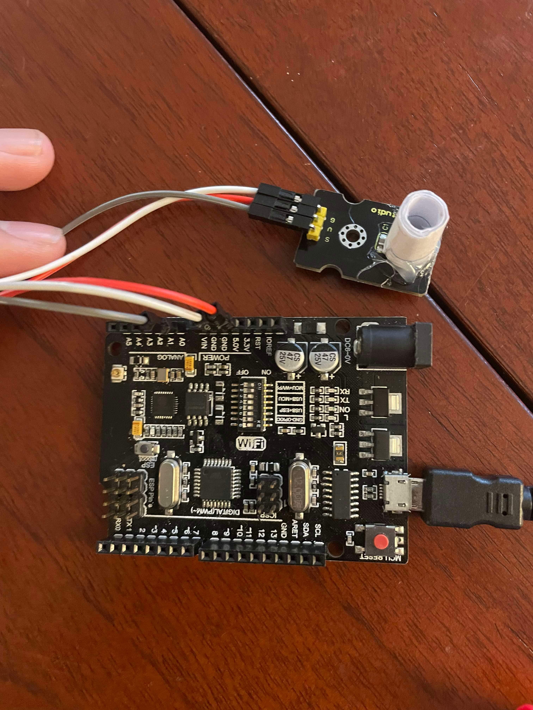

# Custom energy monitor

This repo contains the code required to use the custom energy monitor designed to overcome the limitations of the emerald central meter data reader. The custom energy monitor is an arduino with wifi capabilities connected to an LDR to monitor the number of blinks on the energy meter. 1 blink roughly equates to 1 watt hour of energy

## Structure
The repo is broken down into client and server. The client has `esp.ino` and `ldr.ino`. `esp.ino` sets up the wifi client and connection to the raspberry pi whilst `ldr.ino` handles the blink and ldr logic

`main.py` in server sets up the flask server which sends the data to the raspberry pi

## The custom energy monitor

## Future work
- Create casing for the custom monitor to be able to mount it on the central energy reader
- Create a casing for the ldr to connect to point where the blinks occur